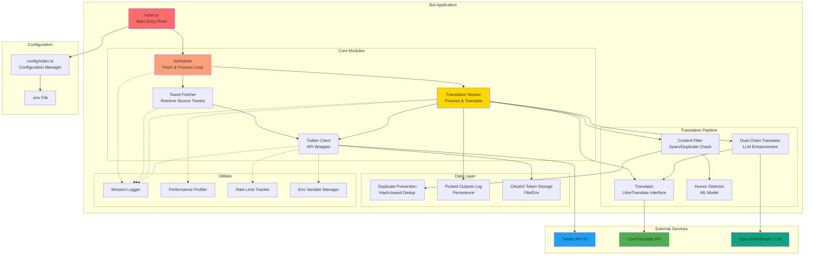

# Architecture Overview

## System Architecture



## Component Descriptions

### Core Modules

#### Index (index.ts)
- **Purpose**: Application entry point
- **Responsibilities**:
  - Initialize configuration
  - Start scheduler
  - Handle graceful shutdown
  - Set up error handlers

#### Scheduler
- **Purpose**: Orchestrate the fetch-translate-post loop
- **Responsibilities**:
  - Fetch tweets at configured intervals
  - Queue tweets for processing
  - Manage worker concurrency
  - Handle rate limits

#### Tweet Fetcher
- **Purpose**: Retrieve source tweets from Twitter
- **Responsibilities**:
  - Fetch tweets from monitored account
  - Filter already-processed tweets
  - Extract tweet metadata
  - Handle pagination

#### Translation Worker
- **Purpose**: Process and translate tweets
- **Responsibilities**:
  - Detect content appropriateness
  - Perform translations (multiple languages)
  - Post translated tweets
  - Handle errors and retries

### Translation Pipeline

#### Translator
- **Purpose**: Interface with LibreTranslate
- **Responsibilities**:
  - Send translation requests
  - Handle response parsing
  - Cache translations (optional)
  - Retry on failures

#### Dual-Chain Translator
- **Purpose**: Enhance translations with LLM
- **Responsibilities**:
  - Use LibreTranslate for base translation
  - Refine with OpenAI/Anthropic
  - Preserve context and tone
  - Handle humor/idioms

#### Humor Detector
- **Purpose**: Detect humorous content
- **Responsibilities**:
  - Run ML inference (ONNX model)
  - Classify tweet sentiment
  - Provide confidence scores
  - Tag for special handling

#### Content Filter
- **Purpose**: Filter spam and duplicates
- **Responsibilities**:
  - Check for spam patterns
  - Detect near-duplicate content
  - Validate tweet quality
  - Apply content policies

### Data Layer

#### Duplicate Prevention
- **Purpose**: Prevent posting duplicate translations
- **Responsibilities**:
  - Generate content hashes
  - Check similarity scores
  - Maintain dedup cache
  - Prune old entries

#### Posted Outputs Log
- **Purpose**: Track posted translations
- **Responsibilities**:
  - Persist posted tweet IDs
  - Store translation metadata
  - Rotate log files
  - Enable audit trail

#### OAuth2 Token Storage
- **Purpose**: Manage Twitter authentication tokens
- **Responsibilities**:
  - Store access/refresh tokens
  - Handle token rotation
  - Refresh expired tokens
  - Fallback to OAuth1

### Utilities

#### Logger (Winston)
- **Purpose**: Centralized logging
- **Features**:
  - Multiple transports (console, file)
  - Log levels (debug, info, warn, error)
  - Structured logging
  - Log rotation

#### Performance Profiler
- **Purpose**: Track operation timing
- **Features**:
  - Start/stop timers
  - Calculate statistics (avg, p50, p95, p99)
  - Export metrics
  - Decorator support

#### Rate Limit Tracker
- **Purpose**: Monitor API rate limits
- **Features**:
  - Track endpoint usage
  - Calculate reset times
  - Prevent limit violations
  - Log warnings

#### Env Writer
- **Purpose**: Manage environment variables
- **Features**:
  - Update .env file
  - Atomic writes
  - Backup support
  - Validation

## Data Flow

### 1. Initialization
```
index.ts → config → scheduler.start()
```

### 2. Tweet Fetching
```
Scheduler (interval) → TweetFetcher → TwitterClient → Twitter API
                     ↓
              Queue tweets for processing
```

### 3. Translation Processing
```
TranslationWorker → ContentFilter (spam/duplicate check)
                  → HumorDetector (classify content)
                  → Translator/DualChain (translate)
                  → TwitterClient (post reply)
                  → PostedOutputs (log)
```

### 4. OAuth2 Token Refresh
```
TwitterClient.ensureFreshToken()
  → Check expiration (<60s left?)
  → refreshOAuth2Token()
  → Update file & env
  → Retry request
```

## Configuration

### Environment Variables

| Variable | Purpose | Required |
|----------|---------|----------|
| `TWITTER_OAUTH2_CLIENT_ID` | OAuth2 client ID | Yes |
| `TWITTER_OAUTH2_REFRESH_TOKEN` | OAuth2 refresh token | Yes |
| `TRANSLATE_FROM_USERNAME` | Source Twitter account | Yes |
| `TARGET_LANGUAGES` | Translation targets | Yes |
| `LIBRETRANSLATE_URL` | Translation service URL | Yes |
| `OPENAI_API_KEY` | OpenAI API key (dual-chain) | No |
| `FETCH_INTERVAL_MS` | Polling interval | No (default: 300000) |
| `ENABLE_PERFORMANCE_METRICS` | Enable profiling | No (default: false) |

## Deployment

### Docker Compose

The application runs in two containers:

1. **LibreTranslate Container**
   - Runs translation service
   - Port 5000 exposed
   - Single-threaded for stability
   - Model persistence via volume

2. **Bot Container**
   - Runs Node.js application
   - Depends on LibreTranslate
   - OAuth token persistence
   - Health checks enabled
   - Log rotation configured

### Volumes

- `libretranslate-models`: Translation models
- `bot-data`: Application data
- `bot-logs`: Application logs
- `.twitter-oauth2-tokens.json`: OAuth tokens (mounted)

## Error Handling

### Retry Strategies

1. **OAuth2 Token Refresh**
   - Max retries: 3
   - Exponential backoff: 1s, 2s, 4s
   - No retry on 400/401 (invalid credentials)
   - Fallback to OAuth1 if configured

2. **Twitter API Requests**
   - Auto-refresh on 401 errors
   - Rate limit detection and backoff
   - Request queuing

3. **Translation Requests**
   - Retry on 5xx errors
   - Timeout handling
   - Fallback to base translation (no LLM)

## Performance Considerations

### Bottlenecks

1. **LibreTranslate**: Single-threaded (stability)
2. **Twitter API**: Rate limits (300/15min)
3. **LLM API**: Cost and latency

### Optimizations

1. **Deduplication**: Hash-based, O(1) lookup
2. **Batch Processing**: Queue tweets, process in parallel
3. **Caching**: Translation results (optional)
4. **Profiling**: Track slow operations

## Security

### Credentials Management

- OAuth2 tokens stored in file and environment
- Token rotation handled automatically
- No credentials in logs
- Secure environment variable injection

### API Security

- Rate limit enforcement
- Request validation
- Error sanitization
- HTTPS only

## Monitoring

### Metrics

- Tweet fetch count
- Translation latency
- API error rates
- Token refresh events
- Duplicate detection rate

### Logging

- Structured JSON logs
- Multiple log levels
- File rotation (10MB, 3 files)
- Console and file outputs

### Health Checks

- Docker health checks every 30s
- Application startup probes
- Service dependency checks

## Testing

### Test Coverage

- Unit tests: 402 tests passing
- Integration tests: OAuth2 refresh
- Mock services: Twitter API, LibreTranslate
- Test utilities: Jest, mocked modules

### Test Categories

1. **Unit Tests**: Individual functions
2. **Integration Tests**: Component interactions
3. **E2E Tests**: Full workflow (manual)

## Future Enhancements

1. **Monitoring Dashboard**: Grafana metrics
2. **Horizontal Scaling**: Multiple bot instances
3. **Database**: Replace file-based storage
4. **Queue System**: Redis/RabbitMQ for tweet processing
5. **CDN Integration**: Image translation support
